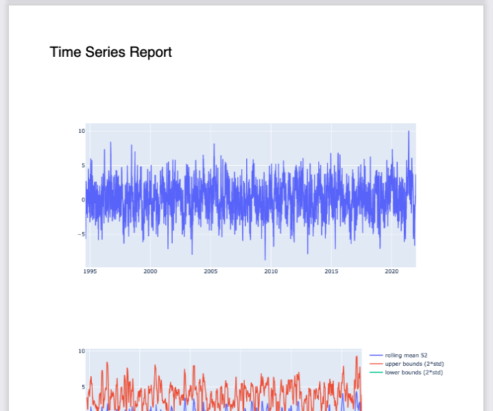
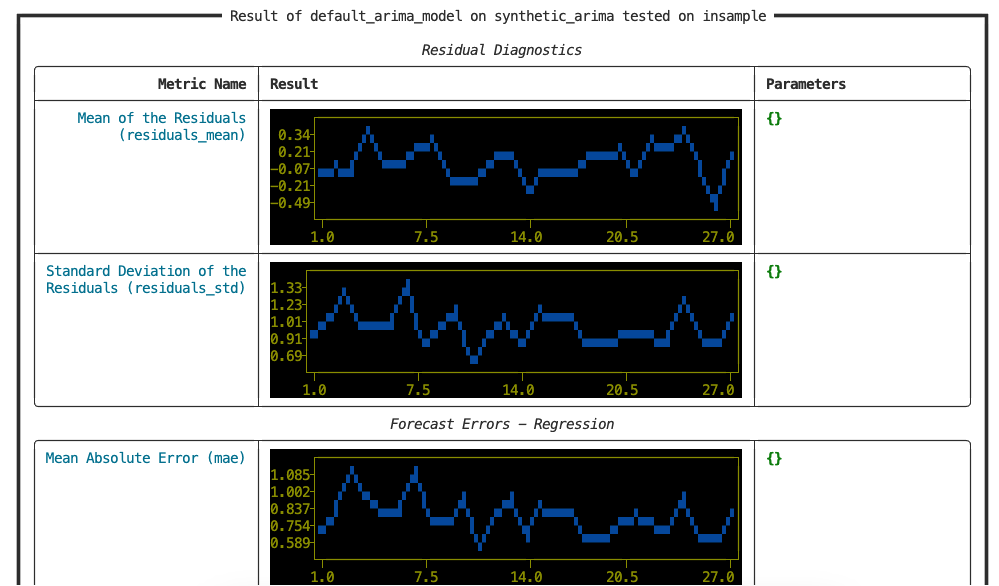

<p align="center">
  <a href="https://img.shields.io/github/actions/workflow/status/dream-faster/krisi/sphinx.yml"></a>
  <a href="https://github.com/psf/black"></a>
</p>


<!-- PROJECT LOGO -->
<br />
<div align="center">
  <a href="https://dream-faster.github.io/krisi/">
    
  </a>

<h3 align="center"> <i>(/creesee/)</i></h3>
  <p align="center">
    Testing and Reporting Framework for Time Series Analysis
    <br />
    <a href="https://github.com/dream-faster/krisi">View Demo</a>  ~
    <a href="https://github.com/dream-faster/krisi/tree/main/src/krisi/examples">Check Examples</a> ~
    <a href="https://dream-faster.github.io/krisi/"><strong>Explore the docs »</strong></a>
  </p>
</div>
<br />

Krisi is a Scoring library for Time-Series Forecasting. It calculates, stores and vizualises the performance of your predictions!

Krisi is from the ground-up extensible and lightweight and comes with the fundmental metrics for regression and classification (wip).

It can generate reports in:
- static **PDF** (with ``plotly``)
- interactive **HTML** (with ``plotly``)
- pretty formatted for **console** (with ``rich`` and ``plotext``)

<br/>

<div>
  
  

</div>
  
<br/>

## Krisi solves the following problems

- Most TS libraries attach reporting to modelling (eg.: Darts, Statsmodel) <br/> **→ Krisi is independent of any modelling method or library**
- Scorecard extendability only works by subclass <br/>
**→ Krisi supports easy configuration of custom metrics along with an extensive library of predefined metrics**
- Rolling window based evaluation <br/>
**→ Krisi supports evaluating metrics over time.**
- Lightweight (few dependcies)<br/>
**→ Krisi has few hard dependencies (only core libarries, eg.: sklearn and plotting libraries)**

<br/>

## Installation


The project was entirely built in ``python``. 

Prerequisites

* ``python >= 3.7`` and ``pip``


Install from git directly

*  ``pip install https://github.com/dream-faster/krisi/archive/main.zip ``

<br/>

## Quickstart

```python
from krisi.evaluate import ScoreCard
import numpy as np

sc = ScoreCard("<your_model_name>")

# Random targets and predictions for Demo
target, predictions = np.random.rand(1000), np.random.rand(1000)

# Calculate predefined metrics
sc.evaluate(target, predictions, defaults=True)

# Add a new metric
sc["own_metric"] = (target - predictions).mean()

# Print the result
sc.print_summary()
```
Outputs:
```
┏━━━━━━━━━━━━━━━━━━━━━━━━ Result of <your_model_name> on <your_dataset_name> tested on insample ━━━━━━━━━━━━━━━━━━━━━━━━━┓
┃                                                                                                                        ┃
┃                                                  Residual Diagnostics                                                  ┃
┃ ╭───────────────────────────┬─────────────────────────────────────────────────────────────┬──────────────────────────╮ ┃
┃ │               Metric Name │ Result                                                      │ Parameters               │ ┃
┃ ├───────────────────────────┼─────────────────────────────────────────────────────────────┼──────────────────────────┤ ┃
┃ │     Mean of the Residuals │ 0.007                                                       │ {}                       │ ┃
┃ │          (residuals_mean) │                                                             │                          │ ┃
┃ ├───────────────────────────┼─────────────────────────────────────────────────────────────┼──────────────────────────┤ ┃
┃ │ Standard Deviation of the │ 0.409                                                       │ {}                       │ ┃
┃ │ Residuals (residuals_std) │                                                             │                          │ ┃
┃ ╰───────────────────────────┴─────────────────────────────────────────────────────────────┴──────────────────────────╯ ┃
┃                                              Forecast Errors - Regression                                              ┃
┃ ╭───────────────────────────┬─────────────────────────────────────────────────────────────┬──────────────────────────╮ ┃
┃ │ Mean Absolute Error (mae) │ 0.332                                                       │ {}                       │ ┃
┃ ├───────────────────────────┼─────────────────────────────────────────────────────────────┼──────────────────────────┤ ┃
┃ │  Mean Absolute Percentage │ 2.85                                                        │ {}                       │ ┃
┃ │              Error (mape) │                                                             │                          │ ┃
┃ ├───────────────────────────┼─────────────────────────────────────────────────────────────┼──────────────────────────┤ ┃
┃ │  Mean Squared Error (mse) │ 0.168                                                       │ {'squared': True}        │ ┃
┃ ├───────────────────────────┼─────────────────────────────────────────────────────────────┼──────────────────────────┤ ┃
┃ │   Root Mean Squared Error │ 0.41                                                        │ {'squared': False}       │ ┃
┃ │                    (rmse) │                                                             │                          │ ┃
┃ ├───────────────────────────┼─────────────────────────────────────────────────────────────┼──────────────────────────┤ ┃
┃ │     Root Mean Squared Log │ 0.281                                                       │ {'squared': False}       │ ┃
┃ │             Error (rmsle) │                                                             │                          │ ┃
┃ ├───────────────────────────┼─────────────────────────────────────────────────────────────┼──────────────────────────┤ ┃
┃ │            R-squared (r2) │ -0.923                                                      │ {}                       │ ┃
┃ ╰───────────────────────────┴─────────────────────────────────────────────────────────────┴──────────────────────────╯ ┃
┃                                                            Unknown                                                     ┃
┃ ╭───────────────────────────┬─────────────────────────────────────────────────────────────┬──────────────────────────╮ ┃
┃ │   own_metric (own_metric) │ 0.007                                                       │ {}                       │ ┃
┃ ╰───────────────────────────┴─────────────────────────────────────────────────────────────┴──────────────────────────╯ ┃
┃                                                                                                                        ┃
┗━━━━━━━━━━━━━━━━━━━━━━━━━━━━━━━━━━━━━━━━━━━━━━━━━━━━━━━━━━━━━━━━━━━━━━━━━━━━━━━━━━━━━━━━━━━━━━━━━━━━━━━━━━━━━━━━━━━━━━━━┛
```

Creating more sophisticated ``Metric``s with metadata. 
```python
import numpy as np
from krisi.evaluate import Metric, MetricCategories, ScoreCard

sc = ScoreCard("<your_model_name>")

# Random targets and predictions for Demo
target, predictions = np.random.rand(100), np.random.rand(100)
# Calculate a random metric for Demo
calculated_metric_example = (target - predictions).mean()

# Adding a simple new metric (a float)
# As a Dictionary:
sc["metric_barebones"] = calculated_metric_example

# As an Object assignment:

sc.another_metric_barebones = calculated_metric_example * 2.0


sc["metric_with_metadata"] = Metric(
    name="A new, own Metric",
    category=MetricCategories.residual,
    result=calculated_metric_example * 3.0,
    parameters={"hyper_1": 5.0},
)

# Updating the metadata of an existing metric
sc.metric_barebones = dict(info="Giving description to a metric")

# Print a pretty summary to the console
sc.print_summary(with_info=True)
```


<br/>


## Default Metrics

See ``evaluate/library/default_metrics.py`` for source.
Contributors are continously adding new default metrics, press watch to keep track of the project and see in issues planned default metrics.

<b> Residual Diagnostics </b>
- Mean of the Residuals
- Standard Deviation of the Residuals
- Ljung Box Statistics
- (wip) Autocorrelation of Residuals


<b> Regression Errors</b>
- Mean Absolute Error
- Mean Absolute Percentage Error
- Mean Squared Error
- Root Mean Squared Error
- Root Mean Squared Log Error


## Contribution


The project uses ``isort`` and ``black`` for formatting.

Submit an issue or reach out to us on info at dream-faster.ai for any inquiries.
