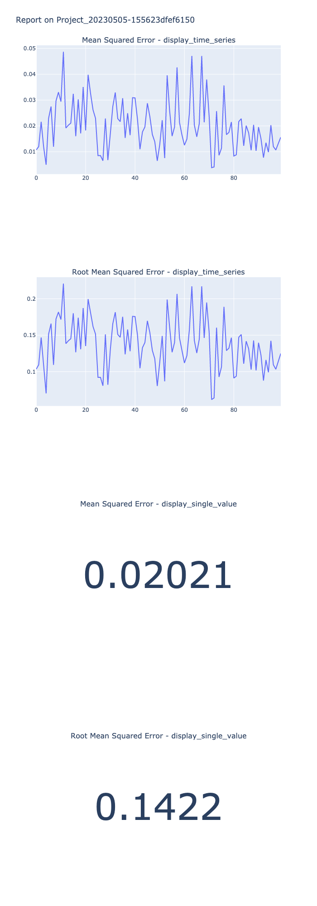

# `Krisi` Quick Intro Notebook
---
Welcome to Krisi! This notebook helps you get onboard with the core functionality of `Krisi`.

By the end you will be able to:
* evaluate your Time-Series predictions, 
* save the results and 
* generate a report.
* comparing multiple scorecards.

---

## Evaluating the results of a single ScoreCard
### First, let's import the needed libraries:


```python
import numpy as np
from krisi import score
import plotly.io as pio
pio.renderers.default = "png"
```

### Generate normally distributed synthetic data for demonstration purposes


```python
y=np.random.random(1000) # Targets
predictions=np.random.random(1000) # Artifical predictions
```

### Use the `score` helper function to evaluate your results

`score` simply wraps `ScoreCard` initalization and `ScoreCard.evaluate()` .


```python
scorecard = score(y, predictions)
```

The ScoreCard object is the main engine of `krisi`. It stores the `targets` and `predictions`, the metrics that we have specified (default metrics and custom metrics) and useful *optional* metadata, such as `model_name`, `dataset_description`, etc.

Once we have the ScoreCard evaluated, we can generate various reports with it.


```python
''' Printing a minimal result by passing in `minimal` '''
scorecard.print('minimal')
```


<div>
<style scoped>
    .dataframe tbody tr th:only-of-type {
        vertical-align: middle;
    }

    .dataframe tbody tr th {
        vertical-align: top;
    }

    .dataframe thead th {
        text-align: right;
    }
</style>
<table border="1" class="dataframe">
  <thead>
    <tr style="text-align: right;">
      <th></th>
      <th>Model_20230505-1556230b8c065c</th>
    </tr>
  </thead>
  <tbody>
    <tr>
      <th>Mean Absolute Error</th>
      <td>0.110889</td>
    </tr>
    <tr>
      <th>Mean Absolute Percentage Error</th>
      <td>7.385812</td>
    </tr>
    <tr>
      <th>Symmetric Mean Absolute Percentage Error</th>
      <td>0.711206</td>
    </tr>
    <tr>
      <th>Mean Squared Error</th>
      <td>0.019479</td>
    </tr>
    <tr>
      <th>Root Mean Squared Error</th>
      <td>0.139567</td>
    </tr>
    <tr>
      <th>R-squared</th>
      <td>-0.948928</td>
    </tr>
    <tr>
      <th>Mean of the Residuals</th>
      <td>0.002519</td>
    </tr>
    <tr>
      <th>Standard Deviation of the Residuals</th>
      <td>0.139614</td>
    </tr>
  </tbody>
</table>
</div>


```python
''' Printing a more detailed result by passing in `extended` (this is the default) '''
scorecard.print('extended')
```


<pre style="white-space:pre;overflow-x:auto;line-height:normal;font-family:Menlo,'DejaVu Sans Mono',consolas,'Courier New',monospace">┏━━━━━━━ Result of Model_20230505-1556230b8c065c on Dataset_20230505-155623dd06a4a6 tested on outofsample ━━━━━━━━┓
┃                                                                                                                 ┃
┃ <span style="font-style: italic">                                       Targets and Predictions Analysis                                        </span> ┃
┃ ╭────────────────────┬──────────────────────────────────────────────────────────┬──────────────┬──────────────╮ ┃
┃ │<span style="font-weight: bold">        Series Type </span>│<span style="font-weight: bold"> Histogram                                                </span>│<span style="font-weight: bold">        Types </span>│<span style="font-weight: bold">     Indicies </span>│ ┃
┃ ├────────────────────┼──────────────────────────────────────────────────────────┼──────────────┼──────────────┤ ┃
┃ │<span style="color: #008080; text-decoration-color: #008080">            Targets </span>│<span style="color: #008080; text-decoration-color: #008080"> </span><span style="color: #008080; text-decoration-color: #008080; background-color: #000000">    </span><span style="color: #808000; text-decoration-color: #808000; background-color: #000000">┌──────────────────────────────────────────────────┐</span><span style="color: #008080; text-decoration-color: #008080"> </span>│<span style="color: #008080; text-decoration-color: #008080">      NaNs: 0 </span>│<span style="color: #008080; text-decoration-color: #008080">     Start: 0 </span>│ ┃
┃ │<span style="color: #008080; text-decoration-color: #008080">                    </span>│<span style="color: #008080; text-decoration-color: #008080"> </span><span style="color: #808000; text-decoration-color: #808000; background-color: #000000">76.0┤</span><span style="color: #008080; text-decoration-color: #008080; background-color: #000000">                     </span><span style="color: #0000ff; text-decoration-color: #0000ff; background-color: #000000">███</span><span style="color: #008080; text-decoration-color: #008080; background-color: #000000">                          </span><span style="color: #808000; text-decoration-color: #808000; background-color: #000000">│</span><span style="color: #008080; text-decoration-color: #008080"> </span>│<span style="color: #008080; text-decoration-color: #008080">       dtype: </span>│<span style="color: #008080; text-decoration-color: #008080">     End: 999 </span>│ ┃
┃ │<span style="color: #008080; text-decoration-color: #008080">                    </span>│<span style="color: #008080; text-decoration-color: #008080"> </span><span style="color: #808000; text-decoration-color: #808000; background-color: #000000">63.3┤</span><span style="color: #008080; text-decoration-color: #008080; background-color: #000000">                  </span><span style="color: #0000ff; text-decoration-color: #0000ff; background-color: #000000">███████████</span><span style="color: #008080; text-decoration-color: #008080; background-color: #000000">                     </span><span style="color: #808000; text-decoration-color: #808000; background-color: #000000">│</span><span style="color: #008080; text-decoration-color: #008080"> </span>│<span style="color: #008080; text-decoration-color: #008080">      float64 </span>│<span style="color: #008080; text-decoration-color: #008080">              </span>│ ┃
┃ │<span style="color: #008080; text-decoration-color: #008080">                    </span>│<span style="color: #008080; text-decoration-color: #008080"> </span><span style="color: #808000; text-decoration-color: #808000; background-color: #000000">50.7┤</span><span style="color: #008080; text-decoration-color: #008080; background-color: #000000">                </span><span style="color: #0000ff; text-decoration-color: #0000ff; background-color: #000000">████████████████</span><span style="color: #008080; text-decoration-color: #008080; background-color: #000000">                  </span><span style="color: #808000; text-decoration-color: #808000; background-color: #000000">│</span><span style="color: #008080; text-decoration-color: #008080"> </span>│<span style="color: #008080; text-decoration-color: #008080">              </span>│<span style="color: #008080; text-decoration-color: #008080">              </span>│ ┃
┃ │<span style="color: #008080; text-decoration-color: #008080">                    </span>│<span style="color: #008080; text-decoration-color: #008080"> </span><span style="color: #808000; text-decoration-color: #808000; background-color: #000000">38.0┤</span><span style="color: #008080; text-decoration-color: #008080; background-color: #000000">              </span><span style="color: #0000ff; text-decoration-color: #0000ff; background-color: #000000">████████████████████</span><span style="color: #008080; text-decoration-color: #008080; background-color: #000000">                </span><span style="color: #808000; text-decoration-color: #808000; background-color: #000000">│</span><span style="color: #008080; text-decoration-color: #008080"> </span>│<span style="color: #008080; text-decoration-color: #008080">              </span>│<span style="color: #008080; text-decoration-color: #008080">              </span>│ ┃
┃ │<span style="color: #008080; text-decoration-color: #008080">                    </span>│<span style="color: #008080; text-decoration-color: #008080"> </span><span style="color: #808000; text-decoration-color: #808000; background-color: #000000">25.3┤</span><span style="color: #008080; text-decoration-color: #008080; background-color: #000000">              </span><span style="color: #0000ff; text-decoration-color: #0000ff; background-color: #000000">██████████████████████</span><span style="color: #008080; text-decoration-color: #008080; background-color: #000000">              </span><span style="color: #808000; text-decoration-color: #808000; background-color: #000000">│</span><span style="color: #008080; text-decoration-color: #008080"> </span>│<span style="color: #008080; text-decoration-color: #008080">              </span>│<span style="color: #008080; text-decoration-color: #008080">              </span>│ ┃
┃ │<span style="color: #008080; text-decoration-color: #008080">                    </span>│<span style="color: #008080; text-decoration-color: #008080"> </span><span style="color: #808000; text-decoration-color: #808000; background-color: #000000">12.7┤</span><span style="color: #008080; text-decoration-color: #008080; background-color: #000000">         </span><span style="color: #0000ff; text-decoration-color: #0000ff; background-color: #000000">███████████████████████████████</span><span style="color: #008080; text-decoration-color: #008080; background-color: #000000">          </span><span style="color: #808000; text-decoration-color: #808000; background-color: #000000">│</span><span style="color: #008080; text-decoration-color: #008080"> </span>│<span style="color: #008080; text-decoration-color: #008080">              </span>│<span style="color: #008080; text-decoration-color: #008080">              </span>│ ┃
┃ │<span style="color: #008080; text-decoration-color: #008080">                    </span>│<span style="color: #008080; text-decoration-color: #008080"> </span><span style="color: #808000; text-decoration-color: #808000; background-color: #000000"> 0.0┤</span><span style="color: #0000ff; text-decoration-color: #0000ff; background-color: #000000">█ ██ ██████████████████████████████████████████ ██</span><span style="color: #808000; text-decoration-color: #808000; background-color: #000000">│</span><span style="color: #008080; text-decoration-color: #008080"> </span>│<span style="color: #008080; text-decoration-color: #008080">              </span>│<span style="color: #008080; text-decoration-color: #008080">              </span>│ ┃
┃ │<span style="color: #008080; text-decoration-color: #008080">                    </span>│<span style="color: #008080; text-decoration-color: #008080"> </span><span style="color: #008080; text-decoration-color: #008080; background-color: #000000">    </span><span style="color: #808000; text-decoration-color: #808000; background-color: #000000">└┬───────────┬────────────┬───────────┬───────────┬┘</span><span style="color: #008080; text-decoration-color: #008080"> </span>│<span style="color: #008080; text-decoration-color: #008080">              </span>│<span style="color: #008080; text-decoration-color: #008080">              </span>│ ┃
┃ │<span style="color: #008080; text-decoration-color: #008080">                    </span>│<span style="color: #008080; text-decoration-color: #008080"> </span><span style="color: #008080; text-decoration-color: #008080; background-color: #000000">   </span><span style="color: #808000; text-decoration-color: #808000; background-color: #000000">-0.35</span><span style="color: #008080; text-decoration-color: #008080; background-color: #000000">       </span><span style="color: #808000; text-decoration-color: #808000; background-color: #000000">-0.17</span><span style="color: #008080; text-decoration-color: #008080; background-color: #000000">        </span><span style="color: #808000; text-decoration-color: #808000; background-color: #000000">0.01</span><span style="color: #008080; text-decoration-color: #008080; background-color: #000000">        </span><span style="color: #808000; text-decoration-color: #808000; background-color: #000000">0.19</span><span style="color: #008080; text-decoration-color: #008080; background-color: #000000">       </span><span style="color: #808000; text-decoration-color: #808000; background-color: #000000">0.37</span><span style="color: #008080; text-decoration-color: #008080; background-color: #000000"> </span><span style="color: #008080; text-decoration-color: #008080"> </span>│<span style="color: #008080; text-decoration-color: #008080">              </span>│<span style="color: #008080; text-decoration-color: #008080">              </span>│ ┃
┃ ├────────────────────┼──────────────────────────────────────────────────────────┼──────────────┼──────────────┤ ┃
┃ │<span style="color: #008080; text-decoration-color: #008080">        Predictions </span>│<span style="color: #008080; text-decoration-color: #008080"> </span><span style="color: #008080; text-decoration-color: #008080; background-color: #000000">    </span><span style="color: #808000; text-decoration-color: #808000; background-color: #000000">┌──────────────────────────────────────────────────┐</span><span style="color: #008080; text-decoration-color: #008080"> </span>│<span style="color: #008080; text-decoration-color: #008080">      NaNs: 0 </span>│<span style="color: #008080; text-decoration-color: #008080">     Start: 0 </span>│ ┃
┃ │<span style="color: #008080; text-decoration-color: #008080">                    </span>│<span style="color: #008080; text-decoration-color: #008080"> </span><span style="color: #808000; text-decoration-color: #808000; background-color: #000000">85.0┤</span><span style="color: #008080; text-decoration-color: #008080; background-color: #000000">                            </span><span style="color: #0000ff; text-decoration-color: #0000ff; background-color: #000000">██</span><span style="color: #008080; text-decoration-color: #008080; background-color: #000000">                    </span><span style="color: #808000; text-decoration-color: #808000; background-color: #000000">│</span><span style="color: #008080; text-decoration-color: #008080"> </span>│<span style="color: #008080; text-decoration-color: #008080">       dtype: </span>│<span style="color: #008080; text-decoration-color: #008080">     End: 999 </span>│ ┃
┃ │<span style="color: #008080; text-decoration-color: #008080">                    </span>│<span style="color: #008080; text-decoration-color: #008080"> </span><span style="color: #808000; text-decoration-color: #808000; background-color: #000000">70.8┤</span><span style="color: #008080; text-decoration-color: #008080; background-color: #000000">                         </span><span style="color: #0000ff; text-decoration-color: #0000ff; background-color: #000000">█████</span><span style="color: #008080; text-decoration-color: #008080; background-color: #000000"> </span><span style="color: #0000ff; text-decoration-color: #0000ff; background-color: #000000">████</span><span style="color: #008080; text-decoration-color: #008080; background-color: #000000">               </span><span style="color: #808000; text-decoration-color: #808000; background-color: #000000">│</span><span style="color: #008080; text-decoration-color: #008080"> </span>│<span style="color: #008080; text-decoration-color: #008080">      float64 </span>│<span style="color: #008080; text-decoration-color: #008080">              </span>│ ┃
┃ │<span style="color: #008080; text-decoration-color: #008080">                    </span>│<span style="color: #008080; text-decoration-color: #008080"> </span><span style="color: #808000; text-decoration-color: #808000; background-color: #000000">56.7┤</span><span style="color: #008080; text-decoration-color: #008080; background-color: #000000">                         </span><span style="color: #0000ff; text-decoration-color: #0000ff; background-color: #000000">██████████</span><span style="color: #008080; text-decoration-color: #008080; background-color: #000000">               </span><span style="color: #808000; text-decoration-color: #808000; background-color: #000000">│</span><span style="color: #008080; text-decoration-color: #008080"> </span>│<span style="color: #008080; text-decoration-color: #008080">              </span>│<span style="color: #008080; text-decoration-color: #008080">              </span>│ ┃
┃ │<span style="color: #008080; text-decoration-color: #008080">                    </span>│<span style="color: #008080; text-decoration-color: #008080"> </span><span style="color: #808000; text-decoration-color: #808000; background-color: #000000">42.5┤</span><span style="color: #008080; text-decoration-color: #008080; background-color: #000000">                     </span><span style="color: #0000ff; text-decoration-color: #0000ff; background-color: #000000">███████████████</span><span style="color: #008080; text-decoration-color: #008080; background-color: #000000"> </span><span style="color: #0000ff; text-decoration-color: #0000ff; background-color: #000000">███</span><span style="color: #008080; text-decoration-color: #008080; background-color: #000000">          </span><span style="color: #808000; text-decoration-color: #808000; background-color: #000000">│</span><span style="color: #008080; text-decoration-color: #008080"> </span>│<span style="color: #008080; text-decoration-color: #008080">              </span>│<span style="color: #008080; text-decoration-color: #008080">              </span>│ ┃
┃ │<span style="color: #008080; text-decoration-color: #008080">                    </span>│<span style="color: #008080; text-decoration-color: #008080"> </span><span style="color: #808000; text-decoration-color: #808000; background-color: #000000">28.3┤</span><span style="color: #008080; text-decoration-color: #008080; background-color: #000000">                    </span><span style="color: #0000ff; text-decoration-color: #0000ff; background-color: #000000">█████████████████████</span><span style="color: #008080; text-decoration-color: #008080; background-color: #000000">         </span><span style="color: #808000; text-decoration-color: #808000; background-color: #000000">│</span><span style="color: #008080; text-decoration-color: #008080"> </span>│<span style="color: #008080; text-decoration-color: #008080">              </span>│<span style="color: #008080; text-decoration-color: #008080">              </span>│ ┃
┃ │<span style="color: #008080; text-decoration-color: #008080">                    </span>│<span style="color: #008080; text-decoration-color: #008080"> </span><span style="color: #808000; text-decoration-color: #808000; background-color: #000000">14.2┤</span><span style="color: #008080; text-decoration-color: #008080; background-color: #000000">                </span><span style="color: #0000ff; text-decoration-color: #0000ff; background-color: #000000">██████████████████████████████</span><span style="color: #008080; text-decoration-color: #008080; background-color: #000000">    </span><span style="color: #808000; text-decoration-color: #808000; background-color: #000000">│</span><span style="color: #008080; text-decoration-color: #008080"> </span>│<span style="color: #008080; text-decoration-color: #008080">              </span>│<span style="color: #008080; text-decoration-color: #008080">              </span>│ ┃
┃ │<span style="color: #008080; text-decoration-color: #008080">                    </span>│<span style="color: #008080; text-decoration-color: #008080"> </span><span style="color: #808000; text-decoration-color: #808000; background-color: #000000"> 0.0┤</span><span style="color: #0000ff; text-decoration-color: #0000ff; background-color: #000000">█      ███████████████████████████████████████████</span><span style="color: #808000; text-decoration-color: #808000; background-color: #000000">│</span><span style="color: #008080; text-decoration-color: #008080"> </span>│<span style="color: #008080; text-decoration-color: #008080">              </span>│<span style="color: #008080; text-decoration-color: #008080">              </span>│ ┃
┃ │<span style="color: #008080; text-decoration-color: #008080">                    </span>│<span style="color: #008080; text-decoration-color: #008080"> </span><span style="color: #008080; text-decoration-color: #008080; background-color: #000000">    </span><span style="color: #808000; text-decoration-color: #808000; background-color: #000000">└┬───────────┬────────────┬───────────┬───────────┬┘</span><span style="color: #008080; text-decoration-color: #008080"> </span>│<span style="color: #008080; text-decoration-color: #008080">              </span>│<span style="color: #008080; text-decoration-color: #008080">              </span>│ ┃
┃ │<span style="color: #008080; text-decoration-color: #008080">                    </span>│<span style="color: #008080; text-decoration-color: #008080"> </span><span style="color: #008080; text-decoration-color: #008080; background-color: #000000">   </span><span style="color: #808000; text-decoration-color: #808000; background-color: #000000">-0.43</span><span style="color: #008080; text-decoration-color: #008080; background-color: #000000">       </span><span style="color: #808000; text-decoration-color: #808000; background-color: #000000">-0.25</span><span style="color: #008080; text-decoration-color: #008080; background-color: #000000">        </span><span style="color: #808000; text-decoration-color: #808000; background-color: #000000">-0.07</span><span style="color: #008080; text-decoration-color: #008080; background-color: #000000">       </span><span style="color: #808000; text-decoration-color: #808000; background-color: #000000">0.11</span><span style="color: #008080; text-decoration-color: #008080; background-color: #000000">       </span><span style="color: #808000; text-decoration-color: #808000; background-color: #000000">0.29</span><span style="color: #008080; text-decoration-color: #008080; background-color: #000000"> </span><span style="color: #008080; text-decoration-color: #008080"> </span>│<span style="color: #008080; text-decoration-color: #008080">              </span>│<span style="color: #008080; text-decoration-color: #008080">              </span>│ ┃
┃ ╰────────────────────┴──────────────────────────────────────────────────────────┴──────────────┴──────────────╯ ┃
┃ <span style="font-style: italic">                                             Residual Diagnostics                                              </span> ┃
┃ ╭─────────────────────────┬──────────────────────────────────────────────────────────┬────────────────────────╮ ┃
┃ │<span style="font-weight: bold">             Metric Name </span>│<span style="font-weight: bold"> Result                                                   </span>│<span style="font-weight: bold"> Parameters             </span>│ ┃
┃ ├─────────────────────────┼──────────────────────────────────────────────────────────┼────────────────────────┤ ┃
┃ │<span style="color: #008080; text-decoration-color: #008080">   Residuals (residuals) </span>│<span style="color: #800080; text-decoration-color: #800080"> </span><span style="color: #008080; text-decoration-color: #008080; font-weight: bold">0</span><span style="color: #800080; text-decoration-color: #800080">     </span><span style="color: #008080; text-decoration-color: #008080; font-weight: bold">-0.039898</span><span style="color: #800080; text-decoration-color: #800080">                                          </span>│<span style="color: #008000; text-decoration-color: #008000"> </span><span style="color: #008000; text-decoration-color: #008000; font-weight: bold">{}</span><span style="color: #008000; text-decoration-color: #008000">                     </span>│ ┃
┃ │<span style="color: #008080; text-decoration-color: #008080">                         </span>│<span style="color: #800080; text-decoration-color: #800080"> </span><span style="color: #008080; text-decoration-color: #008080; font-weight: bold">1</span><span style="color: #800080; text-decoration-color: #800080">     </span><span style="color: #008080; text-decoration-color: #008080; font-weight: bold">-0.115117</span><span style="color: #800080; text-decoration-color: #800080">                                          </span>│<span style="color: #008000; text-decoration-color: #008000">                        </span>│ ┃
┃ │<span style="color: #008080; text-decoration-color: #008080">                         </span>│<span style="color: #800080; text-decoration-color: #800080"> </span><span style="color: #008080; text-decoration-color: #008080; font-weight: bold">2</span><span style="color: #800080; text-decoration-color: #800080">     </span><span style="color: #008080; text-decoration-color: #008080; font-weight: bold">-0.030332</span><span style="color: #800080; text-decoration-color: #800080">                                          </span>│<span style="color: #008000; text-decoration-color: #008000">                        </span>│ ┃
┃ │<span style="color: #008080; text-decoration-color: #008080">                         </span>│<span style="color: #800080; text-decoration-color: #800080"> </span><span style="color: #008080; text-decoration-color: #008080; font-weight: bold">3</span><span style="color: #800080; text-decoration-color: #800080">     </span><span style="color: #008080; text-decoration-color: #008080; font-weight: bold">-0.047416</span><span style="color: #800080; text-decoration-color: #800080">                                          </span>│<span style="color: #008000; text-decoration-color: #008000">                        </span>│ ┃
┃ │<span style="color: #008080; text-decoration-color: #008080">                         </span>│<span style="color: #800080; text-decoration-color: #800080"> </span><span style="color: #008080; text-decoration-color: #008080; font-weight: bold">4</span><span style="color: #800080; text-decoration-color: #800080">      </span><span style="color: #008080; text-decoration-color: #008080; font-weight: bold">0.008044</span><span style="color: #800080; text-decoration-color: #800080">                                          </span>│<span style="color: #008000; text-decoration-color: #008000">                        </span>│ ┃
┃ │<span style="color: #008080; text-decoration-color: #008080">                         </span>│<span style="color: #800080; text-decoration-color: #800080">          </span><span style="color: #808000; text-decoration-color: #808000">...</span><span style="color: #800080; text-decoration-color: #800080">                                             </span>│<span style="color: #008000; text-decoration-color: #008000">                        </span>│ ┃
┃ │<span style="color: #008080; text-decoration-color: #008080">                         </span>│<span style="color: #800080; text-decoration-color: #800080"> </span><span style="color: #008080; text-decoration-color: #008080; font-weight: bold">995</span><span style="color: #800080; text-decoration-color: #800080">   </span><span style="color: #008080; text-decoration-color: #008080; font-weight: bold">-0.016276</span><span style="color: #800080; text-decoration-color: #800080">                                          </span>│<span style="color: #008000; text-decoration-color: #008000">                        </span>│ ┃
┃ │<span style="color: #008080; text-decoration-color: #008080">                         </span>│<span style="color: #800080; text-decoration-color: #800080"> </span><span style="color: #008080; text-decoration-color: #008080; font-weight: bold">996</span><span style="color: #800080; text-decoration-color: #800080">   </span><span style="color: #008080; text-decoration-color: #008080; font-weight: bold">-0.071913</span><span style="color: #800080; text-decoration-color: #800080">                                          </span>│<span style="color: #008000; text-decoration-color: #008000">                        </span>│ ┃
┃ │<span style="color: #008080; text-decoration-color: #008080">                         </span>│<span style="color: #800080; text-decoration-color: #800080"> </span><span style="color: #008080; text-decoration-color: #008080; font-weight: bold">997</span><span style="color: #800080; text-decoration-color: #800080">    </span><span style="color: #008080; text-decoration-color: #008080; font-weight: bold">0.095479</span><span style="color: #800080; text-decoration-color: #800080">                                          </span>│<span style="color: #008000; text-decoration-color: #008000">                        </span>│ ┃
┃ │<span style="color: #008080; text-decoration-color: #008080">                         </span>│<span style="color: #800080; text-decoration-color: #800080"> </span><span style="color: #008080; text-decoration-color: #008080; font-weight: bold">998</span><span style="color: #800080; text-decoration-color: #800080">   </span><span style="color: #008080; text-decoration-color: #008080; font-weight: bold">-0.161347</span><span style="color: #800080; text-decoration-color: #800080">                                          </span>│<span style="color: #008000; text-decoration-color: #008000">                        </span>│ ┃
┃ │<span style="color: #008080; text-decoration-color: #008080">                         </span>│<span style="color: #800080; text-decoration-color: #800080"> </span><span style="color: #008080; text-decoration-color: #008080; font-weight: bold">999</span><span style="color: #800080; text-decoration-color: #800080">   </span><span style="color: #008080; text-decoration-color: #008080; font-weight: bold">-0.319740</span><span style="color: #800080; text-decoration-color: #800080">                                          </span>│<span style="color: #008000; text-decoration-color: #008000">                        </span>│ ┃
┃ │<span style="color: #008080; text-decoration-color: #008080">                         </span>│<span style="color: #800080; text-decoration-color: #800080"> Length: </span><span style="color: #008080; text-decoration-color: #008080; font-weight: bold">1000</span><span style="color: #800080; text-decoration-color: #800080">, dtype: float64                             </span>│<span style="color: #008000; text-decoration-color: #008000">                        </span>│ ┃
┃ ├─────────────────────────┼──────────────────────────────────────────────────────────┼────────────────────────┤ ┃
┃ │<span style="color: #008080; text-decoration-color: #008080">    Ljung Box Statistics </span>│<span style="color: #800080; text-decoration-color: #800080">       lb_stat  lb_pvalue                                 </span>│<span style="color: #008000; text-decoration-color: #008000"> </span><span style="color: #008000; text-decoration-color: #008000; font-weight: bold">{}</span><span style="color: #008000; text-decoration-color: #008000">                     </span>│ ┃
┃ │<span style="color: #008080; text-decoration-color: #008080">  (ljung_box_statistics) </span>│<span style="color: #800080; text-decoration-color: #800080"> </span><span style="color: #008080; text-decoration-color: #008080; font-weight: bold">1</span><span style="color: #800080; text-decoration-color: #800080">    </span><span style="color: #008080; text-decoration-color: #008080; font-weight: bold">0.142215</span><span style="color: #800080; text-decoration-color: #800080">   </span><span style="color: #008080; text-decoration-color: #008080; font-weight: bold">0.706089</span><span style="color: #800080; text-decoration-color: #800080">                                 </span>│<span style="color: #008000; text-decoration-color: #008000">                        </span>│ ┃
┃ │<span style="color: #008080; text-decoration-color: #008080">                         </span>│<span style="color: #800080; text-decoration-color: #800080"> </span><span style="color: #008080; text-decoration-color: #008080; font-weight: bold">2</span><span style="color: #800080; text-decoration-color: #800080">    </span><span style="color: #008080; text-decoration-color: #008080; font-weight: bold">5.292416</span><span style="color: #800080; text-decoration-color: #800080">   </span><span style="color: #008080; text-decoration-color: #008080; font-weight: bold">0.070920</span><span style="color: #800080; text-decoration-color: #800080">                                 </span>│<span style="color: #008000; text-decoration-color: #008000">                        </span>│ ┃
┃ │<span style="color: #008080; text-decoration-color: #008080">                         </span>│<span style="color: #800080; text-decoration-color: #800080"> </span><span style="color: #008080; text-decoration-color: #008080; font-weight: bold">3</span><span style="color: #800080; text-decoration-color: #800080">    </span><span style="color: #008080; text-decoration-color: #008080; font-weight: bold">8.308879</span><span style="color: #800080; text-decoration-color: #800080">   </span><span style="color: #008080; text-decoration-color: #008080; font-weight: bold">0.040041</span><span style="color: #800080; text-decoration-color: #800080">                                 </span>│<span style="color: #008000; text-decoration-color: #008000">                        </span>│ ┃
┃ │<span style="color: #008080; text-decoration-color: #008080">                         </span>│<span style="color: #800080; text-decoration-color: #800080"> </span><span style="color: #008080; text-decoration-color: #008080; font-weight: bold">4</span><span style="color: #800080; text-decoration-color: #800080">    </span><span style="color: #008080; text-decoration-color: #008080; font-weight: bold">8.320772</span><span style="color: #800080; text-decoration-color: #800080">   </span><span style="color: #008080; text-decoration-color: #008080; font-weight: bold">0.080510</span><span style="color: #800080; text-decoration-color: #800080">                                 </span>│<span style="color: #008000; text-decoration-color: #008000">                        </span>│ ┃
┃ │<span style="color: #008080; text-decoration-color: #008080">                         </span>│<span style="color: #800080; text-decoration-color: #800080"> </span><span style="color: #008080; text-decoration-color: #008080; font-weight: bold">5</span><span style="color: #800080; text-decoration-color: #800080">    </span><span style="color: #008080; text-decoration-color: #008080; font-weight: bold">9.975219</span><span style="color: #800080; text-decoration-color: #800080">   </span><span style="color: #008080; text-decoration-color: #008080; font-weight: bold">0.075940</span><span style="color: #800080; text-decoration-color: #800080">                                 </span>│<span style="color: #008000; text-decoration-color: #008000">                        </span>│ ┃
┃ │<span style="color: #008080; text-decoration-color: #008080">                         </span>│<span style="color: #800080; text-decoration-color: #800080"> </span><span style="color: #008080; text-decoration-color: #008080; font-weight: bold">6</span><span style="color: #800080; text-decoration-color: #800080">   </span><span style="color: #008080; text-decoration-color: #008080; font-weight: bold">10.487945</span><span style="color: #800080; text-decoration-color: #800080">   </span><span style="color: #008080; text-decoration-color: #008080; font-weight: bold">0.105551</span><span style="color: #800080; text-decoration-color: #800080">                                 </span>│<span style="color: #008000; text-decoration-color: #008000">                        </span>│ ┃
┃ │<span style="color: #008080; text-decoration-color: #008080">                         </span>│<span style="color: #800080; text-decoration-color: #800080"> </span><span style="color: #008080; text-decoration-color: #008080; font-weight: bold">7</span><span style="color: #800080; text-decoration-color: #800080">   </span><span style="color: #008080; text-decoration-color: #008080; font-weight: bold">10.488062</span><span style="color: #800080; text-decoration-color: #800080">   </span><span style="color: #008080; text-decoration-color: #008080; font-weight: bold">0.162561</span><span style="color: #800080; text-decoration-color: #800080">                                 </span>│<span style="color: #008000; text-decoration-color: #008000">                        </span>│ ┃
┃ │<span style="color: #008080; text-decoration-color: #008080">                         </span>│<span style="color: #800080; text-decoration-color: #800080"> </span><span style="color: #008080; text-decoration-color: #008080; font-weight: bold">8</span><span style="color: #800080; text-decoration-color: #800080">   </span><span style="color: #008080; text-decoration-color: #008080; font-weight: bold">12.309038</span><span style="color: #800080; text-decoration-color: #800080">   </span><span style="color: #008080; text-decoration-color: #008080; font-weight: bold">0.137939</span><span style="color: #800080; text-decoration-color: #800080">                                 </span>│<span style="color: #008000; text-decoration-color: #008000">                        </span>│ ┃
┃ │<span style="color: #008080; text-decoration-color: #008080">                         </span>│<span style="color: #800080; text-decoration-color: #800080"> </span><span style="color: #008080; text-decoration-color: #008080; font-weight: bold">9</span><span style="color: #800080; text-decoration-color: #800080">   </span><span style="color: #008080; text-decoration-color: #008080; font-weight: bold">12.439323</span><span style="color: #800080; text-decoration-color: #800080">   </span><span style="color: #008080; text-decoration-color: #008080; font-weight: bold">0.189660</span><span style="color: #800080; text-decoration-color: #800080">                                 </span>│<span style="color: #008000; text-decoration-color: #008000">                        </span>│ ┃
┃ │<span style="color: #008080; text-decoration-color: #008080">                         </span>│<span style="color: #800080; text-decoration-color: #800080"> </span><span style="color: #008080; text-decoration-color: #008080; font-weight: bold">10</span><span style="color: #800080; text-decoration-color: #800080">  </span><span style="color: #008080; text-decoration-color: #008080; font-weight: bold">15.259462</span><span style="color: #800080; text-decoration-color: #800080">   </span><span style="color: #008080; text-decoration-color: #008080; font-weight: bold">0.122885</span><span style="color: #800080; text-decoration-color: #800080">                                 </span>│<span style="color: #008000; text-decoration-color: #008000">                        </span>│ ┃
┃ ├─────────────────────────┼──────────────────────────────────────────────────────────┼────────────────────────┤ ┃
┃ │<span style="color: #008080; text-decoration-color: #008080">   Mean of the Residuals </span>│<span style="color: #800080; text-decoration-color: #800080"> </span><span style="color: #008080; text-decoration-color: #008080; font-weight: bold">0.003</span><span style="color: #800080; text-decoration-color: #800080">                                                    </span>│<span style="color: #008000; text-decoration-color: #008000"> </span><span style="color: #008000; text-decoration-color: #008000; font-weight: bold">{}</span><span style="color: #008000; text-decoration-color: #008000">                     </span>│ ┃
┃ │<span style="color: #008080; text-decoration-color: #008080">        (residuals_mean) </span>│<span style="color: #800080; text-decoration-color: #800080">                                                          </span>│<span style="color: #008000; text-decoration-color: #008000">                        </span>│ ┃
┃ ├─────────────────────────┼──────────────────────────────────────────────────────────┼────────────────────────┤ ┃
┃ │<span style="color: #008080; text-decoration-color: #008080">   Standard Deviation of </span>│<span style="color: #800080; text-decoration-color: #800080"> </span><span style="color: #008080; text-decoration-color: #008080; font-weight: bold">0.14</span><span style="color: #800080; text-decoration-color: #800080">                                                     </span>│<span style="color: #008000; text-decoration-color: #008000"> </span><span style="color: #008000; text-decoration-color: #008000; font-weight: bold">{}</span><span style="color: #008000; text-decoration-color: #008000">                     </span>│ ┃
┃ │<span style="color: #008080; text-decoration-color: #008080">           the Residuals </span>│<span style="color: #800080; text-decoration-color: #800080">                                                          </span>│<span style="color: #008000; text-decoration-color: #008000">                        </span>│ ┃
┃ │<span style="color: #008080; text-decoration-color: #008080">         (residuals_std) </span>│<span style="color: #800080; text-decoration-color: #800080">                                                          </span>│<span style="color: #008000; text-decoration-color: #008000">                        </span>│ ┃
┃ ╰─────────────────────────┴──────────────────────────────────────────────────────────┴────────────────────────╯ ┃
┃ <span style="font-style: italic">                                         Forecast Errors - Regression                                          </span> ┃
┃ ╭─────────────────────────┬──────────────────────────────────────────────────────────┬────────────────────────╮ ┃
┃ │<span style="color: #008080; text-decoration-color: #008080">     Mean Absolute Error </span>│<span style="color: #800080; text-decoration-color: #800080"> </span><span style="color: #008080; text-decoration-color: #008080; font-weight: bold">0.111</span><span style="color: #800080; text-decoration-color: #800080">                                                    </span>│<span style="color: #008000; text-decoration-color: #008000"> </span><span style="color: #008000; text-decoration-color: #008000; font-weight: bold">{}</span><span style="color: #008000; text-decoration-color: #008000">                     </span>│ ┃
┃ │<span style="color: #008080; text-decoration-color: #008080">                   (mae) </span>│<span style="color: #800080; text-decoration-color: #800080">                                                          </span>│<span style="color: #008000; text-decoration-color: #008000">                        </span>│ ┃
┃ ├─────────────────────────┼──────────────────────────────────────────────────────────┼────────────────────────┤ ┃
┃ │<span style="color: #008080; text-decoration-color: #008080">           Mean Absolute </span>│<span style="color: #800080; text-decoration-color: #800080"> </span><span style="color: #008080; text-decoration-color: #008080; font-weight: bold">7.386</span><span style="color: #800080; text-decoration-color: #800080">                                                    </span>│<span style="color: #008000; text-decoration-color: #008000"> </span><span style="color: #008000; text-decoration-color: #008000; font-weight: bold">{}</span><span style="color: #008000; text-decoration-color: #008000">                     </span>│ ┃
┃ │<span style="color: #008080; text-decoration-color: #008080"> Percentage Error (mape) </span>│<span style="color: #800080; text-decoration-color: #800080">                                                          </span>│<span style="color: #008000; text-decoration-color: #008000">                        </span>│ ┃
┃ ├─────────────────────────┼──────────────────────────────────────────────────────────┼────────────────────────┤ ┃
┃ │<span style="color: #008080; text-decoration-color: #008080"> Symmetric Mean Absolute </span>│<span style="color: #800080; text-decoration-color: #800080"> </span><span style="color: #008080; text-decoration-color: #008080; font-weight: bold">0.711</span><span style="color: #800080; text-decoration-color: #800080">                                                    </span>│<span style="color: #008000; text-decoration-color: #008000"> </span><span style="color: #008000; text-decoration-color: #008000; font-weight: bold">{}</span><span style="color: #008000; text-decoration-color: #008000">                     </span>│ ┃
┃ │<span style="color: #008080; text-decoration-color: #008080">        Percentage Error </span>│<span style="color: #800080; text-decoration-color: #800080">                                                          </span>│<span style="color: #008000; text-decoration-color: #008000">                        </span>│ ┃
┃ │<span style="color: #008080; text-decoration-color: #008080">                 (smape) </span>│<span style="color: #800080; text-decoration-color: #800080">                                                          </span>│<span style="color: #008000; text-decoration-color: #008000">                        </span>│ ┃
┃ ├─────────────────────────┼──────────────────────────────────────────────────────────┼────────────────────────┤ ┃
┃ │<span style="color: #008080; text-decoration-color: #008080">      Mean Squared Error </span>│<span style="color: #800080; text-decoration-color: #800080"> </span><span style="color: #008080; text-decoration-color: #008080; font-weight: bold">0.019</span><span style="color: #800080; text-decoration-color: #800080">                                                    </span>│<span style="color: #008000; text-decoration-color: #008000"> </span><span style="color: #008000; text-decoration-color: #008000; font-weight: bold">{</span><span style="color: #008000; text-decoration-color: #008000">'squared'</span><span style="color: #008000; text-decoration-color: #008000">: </span><span style="color: #00ff00; text-decoration-color: #00ff00; font-style: italic">True</span><span style="color: #008000; text-decoration-color: #008000; font-weight: bold">}</span><span style="color: #008000; text-decoration-color: #008000">      </span>│ ┃
┃ │<span style="color: #008080; text-decoration-color: #008080">                   (mse) </span>│<span style="color: #800080; text-decoration-color: #800080">                                                          </span>│<span style="color: #008000; text-decoration-color: #008000">                        </span>│ ┃
┃ ├─────────────────────────┼──────────────────────────────────────────────────────────┼────────────────────────┤ ┃
┃ │<span style="color: #008080; text-decoration-color: #008080"> Root Mean Squared Error </span>│<span style="color: #800080; text-decoration-color: #800080"> </span><span style="color: #008080; text-decoration-color: #008080; font-weight: bold">0.14</span><span style="color: #800080; text-decoration-color: #800080">                                                     </span>│<span style="color: #008000; text-decoration-color: #008000"> </span><span style="color: #008000; text-decoration-color: #008000; font-weight: bold">{</span><span style="color: #008000; text-decoration-color: #008000">'squared'</span><span style="color: #008000; text-decoration-color: #008000">: </span><span style="color: #ff0000; text-decoration-color: #ff0000; font-style: italic">False</span><span style="color: #008000; text-decoration-color: #008000; font-weight: bold">}</span><span style="color: #008000; text-decoration-color: #008000">     </span>│ ┃
┃ │<span style="color: #008080; text-decoration-color: #008080">                  (rmse) </span>│<span style="color: #800080; text-decoration-color: #800080">                                                          </span>│<span style="color: #008000; text-decoration-color: #008000">                        </span>│ ┃
┃ ├─────────────────────────┼──────────────────────────────────────────────────────────┼────────────────────────┤ ┃
┃ │<span style="color: #008080; text-decoration-color: #008080">   Root Mean Squared Log </span>│<span style="color: #800080; text-decoration-color: #800080"> </span><span style="color: #008000; text-decoration-color: #008000">'Mean Squared Logarithmic Error cannot be used when </span><span style="color: #800080; text-decoration-color: #800080">     </span>│<span style="color: #008000; text-decoration-color: #008000"> </span><span style="color: #008000; text-decoration-color: #008000; font-weight: bold">{</span><span style="color: #008000; text-decoration-color: #008000">'squared'</span><span style="color: #008000; text-decoration-color: #008000">: </span><span style="color: #ff0000; text-decoration-color: #ff0000; font-style: italic">False</span><span style="color: #008000; text-decoration-color: #008000; font-weight: bold">}</span><span style="color: #008000; text-decoration-color: #008000">     </span>│ ┃
┃ │<span style="color: #008080; text-decoration-color: #008080">           Error (rmsle) </span>│<span style="color: #800080; text-decoration-color: #800080"> </span><span style="color: #008000; text-decoration-color: #008000">targets contain negative values.'</span><span style="color: #800080; text-decoration-color: #800080">                        </span>│<span style="color: #008000; text-decoration-color: #008000">                        </span>│ ┃
┃ ├─────────────────────────┼──────────────────────────────────────────────────────────┼────────────────────────┤ ┃
┃ │<span style="color: #008080; text-decoration-color: #008080">       R-squared (r_two) </span>│<span style="color: #800080; text-decoration-color: #800080"> </span><span style="color: #008080; text-decoration-color: #008080; font-weight: bold">-0.949</span><span style="color: #800080; text-decoration-color: #800080">                                                   </span>│<span style="color: #008000; text-decoration-color: #008000"> </span><span style="color: #008000; text-decoration-color: #008000; font-weight: bold">{}</span><span style="color: #008000; text-decoration-color: #008000">                     </span>│ ┃
┃ ╰─────────────────────────┴──────────────────────────────────────────────────────────┴────────────────────────╯ ┃
┃                                                                                                                 ┃
┗━━━━━━━━━━━━━━━━━━━━━━━━━━━━━━━━━━━━━━━━━━━━━━━━━━━━━━━━━━━━━━━━━━━━━━━━━━━━━━━━━━━━━━━━━━━━━━━━━━━━━━━━━━━━━━━━━┛
</pre>


In jupyter notebook you can return the object and get a minimal report and the console representation printed (for exploring while debugging)


```python
scorecard
```


<div>
<style scoped>
    .dataframe tbody tr th:only-of-type {
        vertical-align: middle;
    }

    .dataframe tbody tr th {
        vertical-align: top;
    }

    .dataframe thead th {
        text-align: right;
    }
</style>
<table border="1" class="dataframe">
  <thead>
    <tr style="text-align: right;">
      <th></th>
      <th>Model_20230505-1556230b8c065c</th>
    </tr>
  </thead>
  <tbody>
    <tr>
      <th>Mean Absolute Error</th>
      <td>0.110889</td>
    </tr>
    <tr>
      <th>Mean Absolute Percentage Error</th>
      <td>7.385812</td>
    </tr>
    <tr>
      <th>Symmetric Mean Absolute Percentage Error</th>
      <td>0.711206</td>
    </tr>
    <tr>
      <th>Mean Squared Error</th>
      <td>0.019479</td>
    </tr>
    <tr>
      <th>Root Mean Squared Error</th>
      <td>0.139567</td>
    </tr>
    <tr>
      <th>R-squared</th>
      <td>-0.948928</td>
    </tr>
    <tr>
      <th>Mean of the Residuals</th>
      <td>0.002519</td>
    </tr>
    <tr>
      <th>Standard Deviation of the Residuals</th>
      <td>0.139614</td>
    </tr>
  </tbody>
</table>
</div>


    <krisi.evaluate.scorecard.ScoreCard object at 0x29c6a4670>


# Evaluating on a rolling basis

The most important feature of `krisi` is that you can evaluate metrics over time.


```python
scorecard_rolling = score(y, predictions, calculation='rolling') # calculation can be 'rolling', 'single' or 'benchmark'
```

    /Users/daniel/mambaforge/envs/krisitest/lib/python3.10/site-packages/sklearn/metrics/_regression.py:918: UndefinedMetricWarning:
    
    R^2 score is not well-defined with less than two samples.
    


We can then generate an `interactive` (html dash) and `pdf` report, but first let's save the scorecard!

## Save and load ScoreCards

When saving a scorecard we can decide if we also want to save the console output, by specifying `save_modes`. Options are: 
   * `SaveModes.minimal` (Minimal output as previously in the cell)
   * `SaveModes.obj` (Saves the entire object to a pickle file)
   * `SaveModes.text` (Saves the output of the console into a `txt` file)
   * `SaveModes.svg` (Creates an `svg` image of the console output)
   * `SaveModes.html` (Creates an `html` version of the console output)

Let's just save the scorecard object that we can load in later, by passing in either `[SaveMode.obj]` or simply `["obj"]`.

Two things to note:
* The scorecard gets saved by default to `output/<project_name>/<scorecards>/<current_time>`. However, we only need to worry about the `project_name` when loading, our helper function scans the directory of the specified project.
* `ScoreCard.save()` throws back itself, so that you can immediately chain a `print()`


```python
scorecard.metadata.project_name = "Our example project"
scorecard.save(save_modes=["obj"]).print('minimal')
```


<pre style="white-space:pre;overflow-x:auto;line-height:normal;font-family:Menlo,'DejaVu Sans Mono',consolas,'Courier New',monospace"></pre>


<div>
<style scoped>
    .dataframe tbody tr th:only-of-type {
        vertical-align: middle;
    }

    .dataframe tbody tr th {
        vertical-align: top;
    }

    .dataframe thead th {
        text-align: right;
    }
</style>
<table border="1" class="dataframe">
  <thead>
    <tr style="text-align: right;">
      <th></th>
      <th>Model_20230505-1556230b8c065c</th>
    </tr>
  </thead>
  <tbody>
    <tr>
      <th>Mean Absolute Error</th>
      <td>0.110889</td>
    </tr>
    <tr>
      <th>Mean Absolute Percentage Error</th>
      <td>7.385812</td>
    </tr>
    <tr>
      <th>Symmetric Mean Absolute Percentage Error</th>
      <td>0.711206</td>
    </tr>
    <tr>
      <th>Mean Squared Error</th>
      <td>0.019479</td>
    </tr>
    <tr>
      <th>Root Mean Squared Error</th>
      <td>0.139567</td>
    </tr>
    <tr>
      <th>R-squared</th>
      <td>-0.948928</td>
    </tr>
    <tr>
      <th>Mean of the Residuals</th>
      <td>0.002519</td>
    </tr>
    <tr>
      <th>Standard Deviation of the Residuals</th>
      <td>0.139614</td>
    </tr>
  </tbody>
</table>
</div>


Once we have saved the object we can load it in. `load_scorecards` loads in all `scorecards` from a project

# Compare multiple scorecards


```python
from krisi import compare

compare([score(np.random.random(1000), np.random.random(1000)) for _ in range(5)], sort_by='rmse', metric_keys=['mae', 'mse'])
```


<div>
<style scoped>
    .dataframe tbody tr th:only-of-type {
        vertical-align: middle;
    }

    .dataframe tbody tr th {
        vertical-align: top;
    }

    .dataframe thead th {
        text-align: right;
    }
</style>
<table border="1" class="dataframe">
  <thead>
    <tr style="text-align: right;">
      <th></th>
      <th>rmse</th>
      <th>mae</th>
      <th>mse</th>
    </tr>
  </thead>
  <tbody>
    <tr>
      <th>Model_20230505-155623f4dca2dc</th>
      <td>0.141890</td>
      <td>0.111921</td>
      <td>0.020133</td>
    </tr>
    <tr>
      <th>Model_20230505-155623091dd4f4</th>
      <td>0.140953</td>
      <td>0.113679</td>
      <td>0.019868</td>
    </tr>
    <tr>
      <th>Model_20230505-155623d050bca6</th>
      <td>0.140538</td>
      <td>0.112274</td>
      <td>0.019751</td>
    </tr>
    <tr>
      <th>Model_20230505-155623b6186a6d</th>
      <td>0.140259</td>
      <td>0.112374</td>
      <td>0.019673</td>
    </tr>
    <tr>
      <th>Model_20230505-1556234df3034c</th>
      <td>0.138824</td>
      <td>0.111550</td>
      <td>0.019272</td>
    </tr>
  </tbody>
</table>
</div>


```python
from krisi import load_scorecards

last_scorecard = load_scorecards("Our example project")[-1]
```

You can also save scorecards and load them in. `krisi` will save and load from the directory under the same `project_name` so we should specify the name.


```python
project_name = "Comparing Multiple Scorecards"

for i in range(5):
    score(np.random.random(1000), 
          np.random.random(1000), 
          project_name=project_name).save()

compare(load_scorecards(project_name), sort_by='rmse', metric_keys=['mae', 'mse'])
```


<pre style="white-space:pre;overflow-x:auto;line-height:normal;font-family:Menlo,'DejaVu Sans Mono',consolas,'Courier New',monospace"></pre>


<pre style="white-space:pre;overflow-x:auto;line-height:normal;font-family:Menlo,'DejaVu Sans Mono',consolas,'Courier New',monospace"></pre>


<pre style="white-space:pre;overflow-x:auto;line-height:normal;font-family:Menlo,'DejaVu Sans Mono',consolas,'Courier New',monospace"></pre>


<pre style="white-space:pre;overflow-x:auto;line-height:normal;font-family:Menlo,'DejaVu Sans Mono',consolas,'Courier New',monospace"></pre>


<pre style="white-space:pre;overflow-x:auto;line-height:normal;font-family:Menlo,'DejaVu Sans Mono',consolas,'Courier New',monospace"></pre>


<div>
<style scoped>
    .dataframe tbody tr th:only-of-type {
        vertical-align: middle;
    }

    .dataframe tbody tr th {
        vertical-align: top;
    }

    .dataframe thead th {
        text-align: right;
    }
</style>
<table border="1" class="dataframe">
  <thead>
    <tr style="text-align: right;">
      <th></th>
      <th>rmse</th>
      <th>mae</th>
      <th>mse</th>
    </tr>
  </thead>
  <tbody>
    <tr>
      <th>Model_20230505-1556239fd52082</th>
      <td>0.145031</td>
      <td>0.114443</td>
      <td>0.021034</td>
    </tr>
    <tr>
      <th>Model_20230505-15562381bcb4bc</th>
      <td>0.144074</td>
      <td>0.113683</td>
      <td>0.020757</td>
    </tr>
    <tr>
      <th>Model_20230505-155623b6723ba4</th>
      <td>0.142404</td>
      <td>0.113606</td>
      <td>0.020279</td>
    </tr>
    <tr>
      <th>Model_20230505-155623bcce900c</th>
      <td>0.140336</td>
      <td>0.112343</td>
      <td>0.019694</td>
    </tr>
    <tr>
      <th>Model_20230505-155623a79f49e0</th>
      <td>0.140335</td>
      <td>0.111867</td>
      <td>0.019694</td>
    </tr>
  </tbody>
</table>
</div>


# Creating Reports

For reporting you need to install `krisi[plotting]`: `pip install krisi[plotting]`

There are five modes for reports:
   * `DisplayMode.pdf` or `pdf`: Creates a pdf report from the evaluated `ScoreCard`)
   * `DisplayMode.interactive` or `interactive`: Creates an interactive web version of the `ScoreCard` with `Dash`)
   * `DisplayMode.direct` or `direct`: Displays the plots individually directly in the notebook or webpage if launch outside of a notebook
   * `DisplayMode.direct_save` or `direct_save`:  Saves the plots individually
   * `DisplayMode.direct_one_subplot` or `direct_one_subplot`: Same as `direct`, except all plots are contained in one plot as subplots.

`scorecard.generate_report()` can receive a list of `DisplayModes` so you can mix and match the view (eg.: generate a pdf and also launch an interactive exploration)

For saved files look in `output/<project_name>` for saved plots look in `output/<project_name>/diagrams`


```python
scorecard_rolling = score(np.random.random(1000), np.random.random(1000), calculation='single')
```

    /Users/daniel/mambaforge/envs/krisitest/lib/python3.10/site-packages/sklearn/metrics/_regression.py:918: UndefinedMetricWarning:
    
    R^2 score is not well-defined with less than two samples.
    


```python
 # We can slice the scorecard to only include the metrics we want to display
scorecard_rolling[['rmse', 'mse']].generate_report('direct_one_subplot')
```


    

    


```python
scorecard_rolling.generate_report(['direct_save', 'pdf'])
```


```python
# scorecard_rolling.generate_report('interactive')
```
